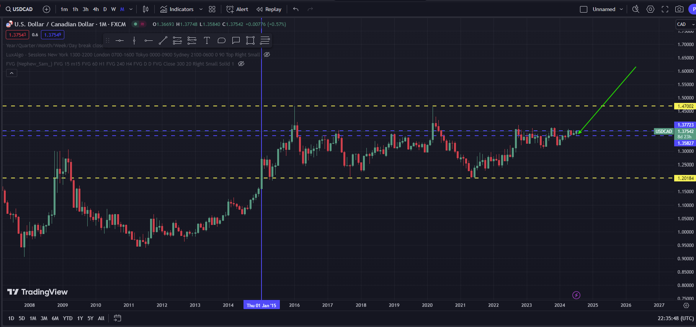
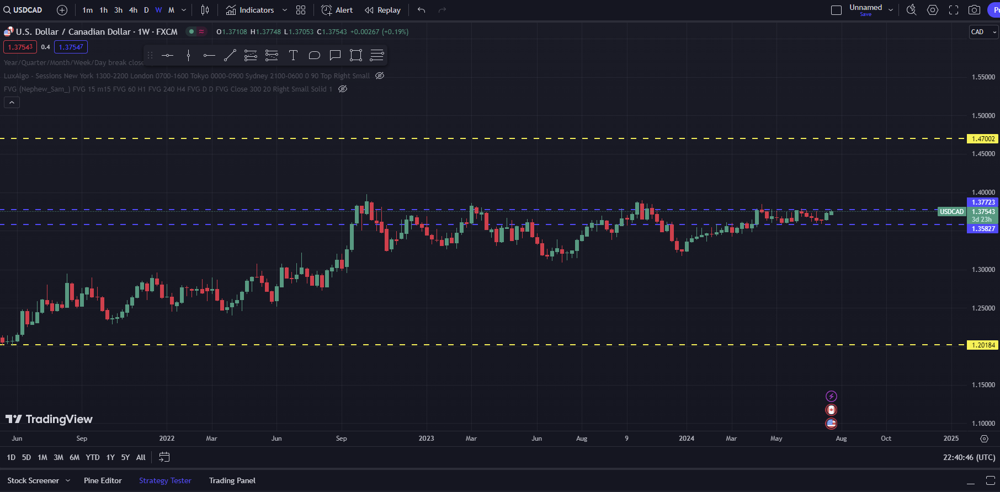
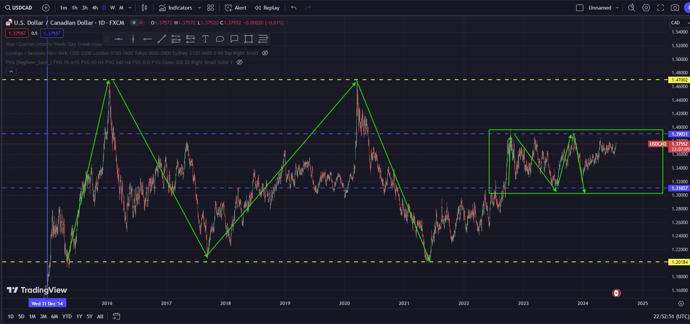

# This is a continuation of the previous analysis on `usdCAD.md`. Four days after.

- our final weekly conclusion was:
    #### conclusion

    - so Before moving to the `daily` timeframe we `conclude` that:
        1) The last candle on the monthly timeframe is a `doji` which means `indecision` betweeen `buyers` and `sellers`. `No one is in control of the market`
        2) When we go to the `weekly` timeframe then we observe that during the `weeks of july` a `morning star` pattern has formed and `the market was ranging` . Given that this pattern forms at the middle of the `ranging` then it indicates a shift in momentum towards the bullish.

- We can observe that a `bullish` momentum was gained.

# The Monthly 

- Previously 0n `07-18-2024` the `last candle` was a `doji`. As of today `23-07-2024` we can see that a `bullish momentum` was gained. 

# Weekly

As of `07-18-2024` a `morning star` was formed on the `weekly` time. which meant a bullish `reversal` . on `07-23-2024` the bulls are gaining momentum.

# Daily

        This is recorded as of today `07/23/2024`.

1) ### The market structure

- The market is `ranging` as from `01-01-2015`. 
- As of `october-2022` it entered a zone of consolidation as `marked` with a `rectangular shape`. 
- Inside the consolidation it was also `ranging`

2) ### The previous candle

- The previous candle is a bullish candle .
- The bulls are gainig momentum against the `bears`

### conclusion.

1) `Monthly` previous candle is a `bullish candle`
2) `Weekly` previous candle is a `bullish candle`
3) `Daily` previous candle is a `bullish` candle.
4) The market is `ranging`.
5) A `shift` in momentum towards the `bullish` towards `the weekly ` resistance
