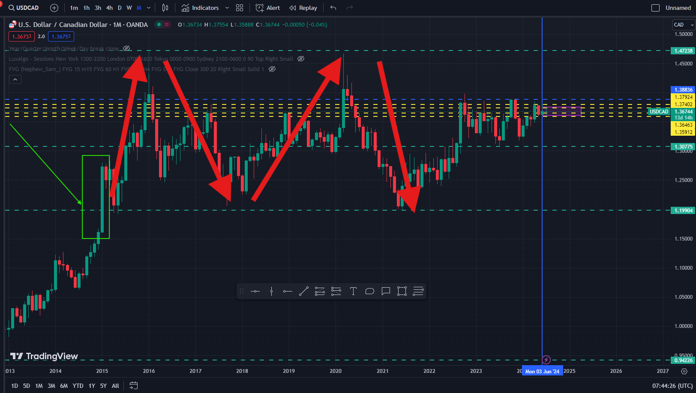
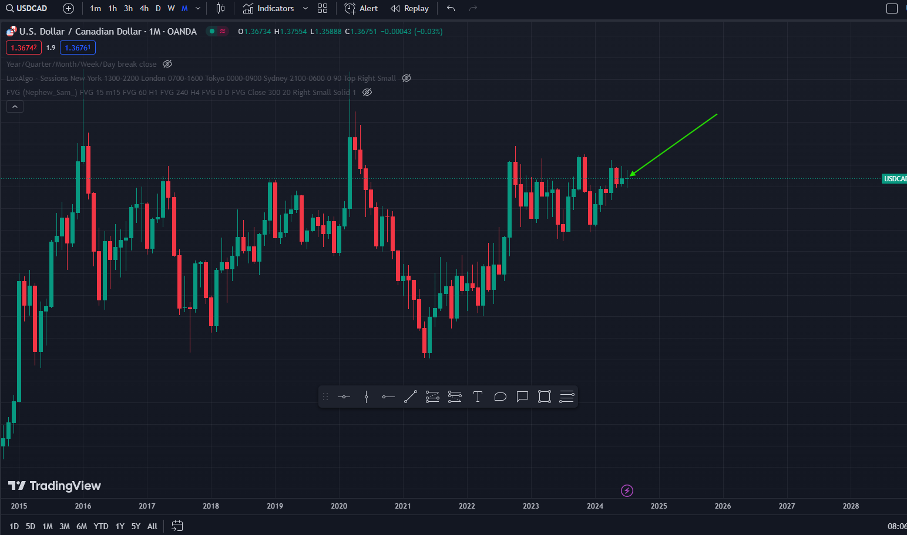
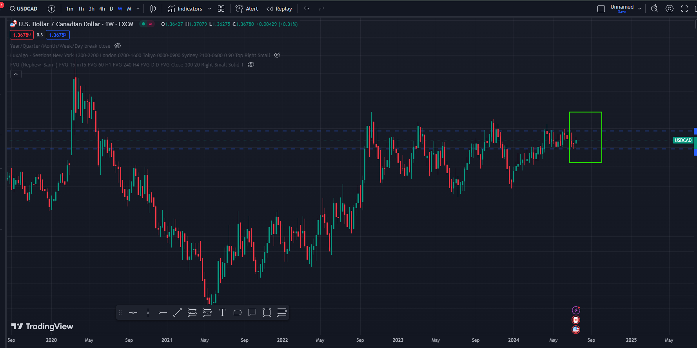

# Daily Analysis of the USDCAD  on 07/18/2024 And It's comparison to the Dollar Index. DXY

## USDCAD Analysis Using Top Down Analysis

### Monthly Analysis
1) #### Identify key level support and resistance.

2) #### Identify the market structure if it is `trending`, `choppy` or `ranging`
    - Buyers and sellers seem to keep knocking price back and forth between the support and the resistance level. So the market is `horizontal` / `ranging`. from 2015 jan 1. 
    - on `jan-1-2015` We seem to observe a big block of `buy` orders getting executed which pushes the price up. That is an `order block`
    

3) #### Previous candle

    - The last candle is a `doji candlestick pattern`. This tells us that `in the month of july 2024, the market has been opening and closing at the same price which means neither the buyers nor the sellers are in control of the market.` There is equality in decision making. so the market `has not decided which direction to take`.

    

    - so when we move to the weekly chart we see a `swing point` in creation in the month of `july`

    

### Weekly Analysis
1) #### Identify key level support and resistance.

- on the right we see price is `consolidating` but still `ranging` on a particular resistance and support

- on `looking closer` to the `consolidation zone` we see that the market is `ranging`.

3) #### Previous candle

- Observing the weekly last candle which happens to be `bullish`, we can also observe that `morning star pattern` is formed. 

- This is because it fulfills the following fundamentals:
    

#### conclusion

- so Before moving to the `daily` timeframe we `conclude` that:
    1) The last candle on the monthly timeframe is a `doji` which means `indecision` betweeen `buyers` and `sellers`. `No one is in control of the market`
    2) When we go to the `weekly` timeframe then we observe that during the `weeks of july` a `morning star` pattern has formed and `the market was ranging` . Given that this pattern forms at the middle of the `ranging` then it indicates a shift in momentum towards the bullish.

### Daily time frame analysis

